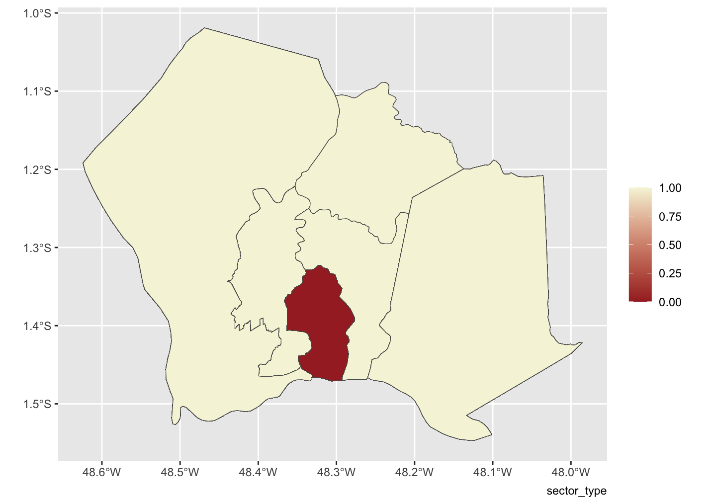
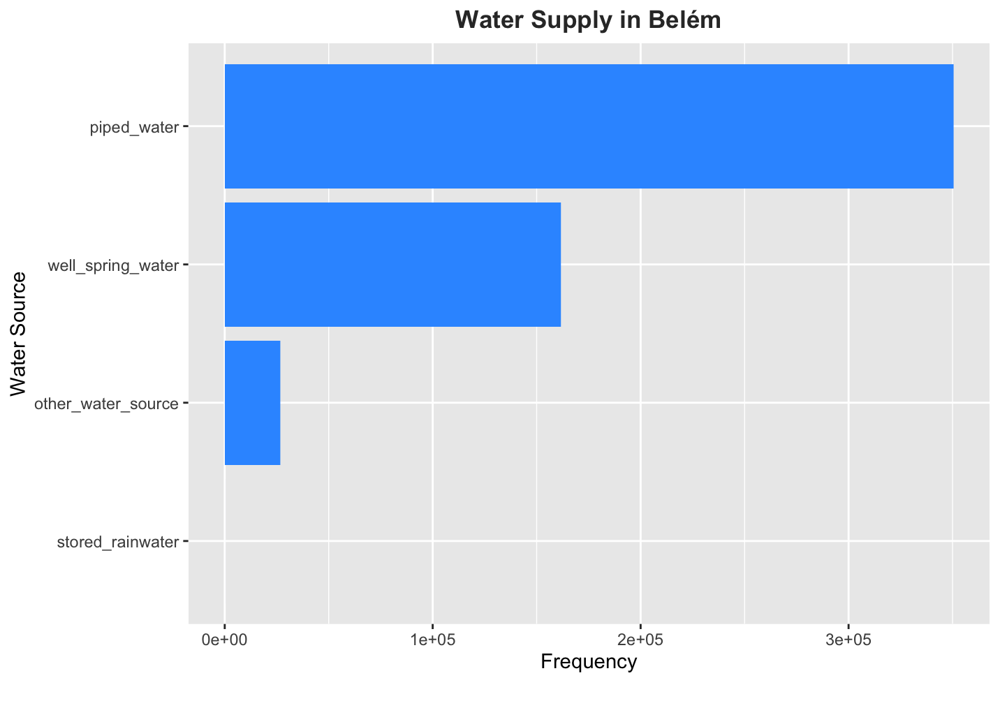

<!-- README.md is generated from README.Rmd. Please edit that file -->

```{r, include = FALSE}
knitr::opts_chunk$set(
  collapse = TRUE,
  comment = "#>",
  fig.path = "man/figures/README-",
  out.width = "100%"
)

library(tidyverse)
```

# wsabrazil

<!-- badges: start -->
[](https://creativecommons.org/licenses/by/4.0/)
[](https://github.com/openwashdata/wsabrazil/actions/workflows/R-CMD-check.yaml)
<!-- badges: end -->

This package contains information related to wastewater management practices and household infrastructure in the Metropolitan Region of Belém, Brazil. It includes variables such as sector codes, metropolitan region names, municipality codes, and names, as well as data on the location type, living conditions, average income, and household amenities. The data provides insights into wastewater disposal habits, water supply sources, bathroom facilities, and sanitation infrastructure in Brazilian households, contributing to understanding environmental sustainability and infrastructure development efforts. @atlas


Based on the data, it appears for example that the municipality of Marituba exhibits poorer housing conditions compared to others. In this dataset, housing conditions are represented numerically, with '1' indicating correct housing conditions and '0' indicating poor housing conditions. The location map displays the Metropolitan Region of Belém.

## Installation

You can install the development version of wsabrazil from [GitHub](https://github.com/) with:

```r
# install.packages("devtools")
devtools::install_github("openwashdata/wsabrazil")
```

Alternatively, you can download the dataset as a CSV or XLSX
file from the table below.

```{r, echo=FALSE, message=FALSE, warning=FALSE}

extdata_path <- "https://github.com/openwashdata/wsabrazil/raw/main/inst/extdata/"

read_csv("data-raw/dictionary.csv") |> 
  distinct(file_name) |> 
  dplyr::mutate(file_name = str_remove(file_name, ".rda")) |> 
  dplyr::rename(dataset = file_name) |> 
  mutate(
    CSV = paste0("[Download CSV](", extdata_path, dataset, ".csv)"),
    XLSX = paste0("[Download XLSX](", extdata_path, dataset, ".xlsx)")
  ) |> 
  knitr::kable()

```

## Data

The dataset includes observations of wastewater management practices and household infrastructure (access to water and sanitation services) across various regions in Brazil.

The data was collected in 2010 and the package provides access to one single dataset.

```{r, echo = TRUE}
library(wsabrazil)
```

The `wsabrazil` dataset has `r ncol(wsabrazil)`
variables and `r nrow(wsabrazil)` observations. For an overview
of the variable names, see the following table.

```{r, eval=FALSE}
wsabrazil
```

```{r, echo=FALSE, message=FALSE, warning=FALSE}
readr::read_csv("data-raw/dictionary.csv") |> 
  dplyr::filter(file_name == "wsabrazil.rda") |> 
  dplyr::select(variable_name:description) |> 
  knitr::kable() |> 
  kableExtra::kable_styling() |> 
  kableExtra::scroll_box(height = "400px")
```

## Example

```{r eval=FALSE, message=FALSE, warning=FALSE, include=FALSE, paged.print=FALSE}
library(wsabrazil)
library(ggplot2)
library(sf)
library(dplyr)
library(cowplot)

shapefile <- st_read("man/PA.min.json")
merged_data <- merge(shapefile, wsabrazil, by.x = "GEOCODIGO", by.y = "municipality_code")

# Plot the choropleth map
ggplot() +
  geom_sf(data = merged_data, aes(fill = sector_type)) +
  scale_fill_gradient(name = "", low = "brown", high = "beige") +
  labs(caption = "sector_type", title = "Housing Conditions Across Municipalities") +
  theme(plot.title = element_text(hjust = 0.5, face = "bold"))
```

From the dataset, we can explore the distribution of water sources in the Metropolitan Region of Belém. We create here a horizontal bar plot to visualize the frequency of different water sources available, utilizing variables such as piped water or stored rainwater. We observe from the resulting plot (see Figure below) that the majority of private households are supplied by piped water. Interestingly, none of the households store rainwater. This is possibly due to factors such as local climate patterns and infrastructure limitations.
```{r, eval=FALSE}
library(dplyr)
library(ggplot2)
library(wsabrazil)

# Reshape the data into long format
data_long <- wsabrazil |> 
  tidyr::pivot_longer(cols = piped_water:other_water_source, 
                      names_to = "water_source", 
                      values_to = "frequency")
  
# Create a horizontal bar plot of water source types
ggplot(data_long, aes(x = frequency, y = reorder(water_source, frequency))) +
  geom_bar(stat = "identity", fill = "#3399FF") +
  labs(x = "Frequency", y = "Water Source", 
       title = "Water Supply in Belém", 
       caption = "") +
  theme(plot.title = element_text(hjust = 0.5, face = "bold", color = "#333333"))

```


## License

Data are available as 
[CC-BY](https://github.com/openwashdata/wsabrazil/LICENSE.md).

## Citation

To cite this package, please use:

```{r}
citation("wsabrazil")
```

## References

```{html, echo = FALSE}
<div id="refs"></div>
```

