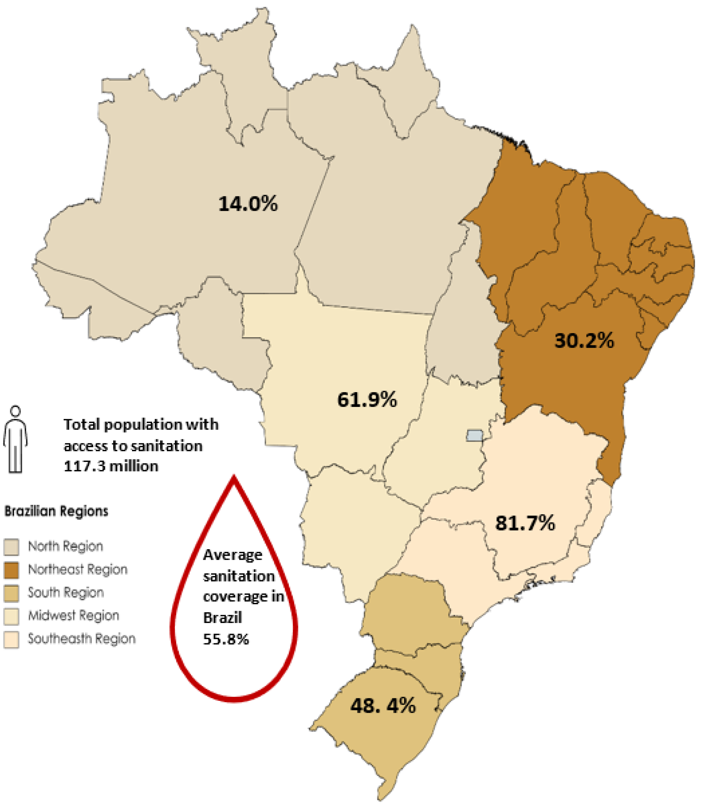

<!-- README.md is generated from README.Rmd. Please edit that file -->

# wsabrazil

<!-- badges: start -->

[](https://creativecommons.org/licenses/by/4.0/)
<!-- badges: end -->

This package contains information related to wastewater management
practices and household infrastructure across various regions in Brazil.
It includes variables such as sector codes, metropolitan region names,
municipality codes, and names, as well as data on the location type,
living conditions, average income, and household amenities. The data
provides insights into wastewater disposal habits, water supply sources,
bathroom facilities, and sanitation infrastructure in Brazilian
households, contributing to understanding environmental sustainability
and infrastructure development efforts.



## Installation

You can install the development version of wsabrazil from
[GitHub](https://github.com/) with:

``` r
# install.packages("devtools")
devtools::install_github("openwashdata/wsabrazil")
```

Alternatively, you can download the dataset as a CSV or XLSX file from
the table below.

| dataset   | CSV                                                                                           | XLSX                                                                                            |
|:----------|:----------------------------------------------------------------------------------------------|:------------------------------------------------------------------------------------------------|
| wsabrazil | [Download CSV](https://github.com/openwashdata/wsabrazil/raw/main/inst/extdata/wsabrazil.csv) | [Download XLSX](https://github.com/openwashdata/wsabrazil/raw/main/inst/extdata/wsabrazil.xlsx) |

## Data

The dataset includes observations of wastewater management practices and
household infrastructure (access to water and sanitation services)
across various regions in Brazil.

The package provides access to one single dataset.

``` r
library(wsabrazil)
```

The `wsabrazil` dataset has 19 variables and 1965 observations. For an
overview of the variable names, see the following table.

``` r
wsabrazil
```

<div style="border: 1px solid #ddd; padding: 0px; overflow-y: scroll; height:400px; ">

<table class="table" style="margin-left: auto; margin-right: auto;">
<thead>
<tr>
<th style="text-align:left;position: sticky; top:0; background-color: #FFFFFF;">
variable_name
</th>
<th style="text-align:left;position: sticky; top:0; background-color: #FFFFFF;">
variable_type
</th>
<th style="text-align:left;position: sticky; top:0; background-color: #FFFFFF;">
description
</th>
</tr>
</thead>
<tbody>
<tr>
<td style="text-align:left;">
sector_code
</td>
<td style="text-align:left;">
double
</td>
<td style="text-align:left;">
sector code
</td>
</tr>
<tr>
<td style="text-align:left;">
MR_name
</td>
<td style="text-align:left;">
character
</td>
<td style="text-align:left;">
metropolitan region name
</td>
</tr>
<tr>
<td style="text-align:left;">
municipality_code
</td>
<td style="text-align:left;">
integer
</td>
<td style="text-align:left;">
municipality code
</td>
</tr>
<tr>
<td style="text-align:left;">
municipality_name
</td>
<td style="text-align:left;">
character
</td>
<td style="text-align:left;">
municipality name
</td>
</tr>
<tr>
<td style="text-align:left;">
sector_situation
</td>
<td style="text-align:left;">
integer
</td>
<td style="text-align:left;">
location type: urban or rural
</td>
</tr>
<tr>
<td style="text-align:left;">
sector_type
</td>
<td style="text-align:left;">
character
</td>
<td style="text-align:left;">
living conditions: 1 stands for correct housing conditions, 0 stands for
poor housing conditions
</td>
</tr>
<tr>
<td style="text-align:left;">
avg_income
</td>
<td style="text-align:left;">
character
</td>
<td style="text-align:left;">
average nominal monthly income of permanent private households
</td>
</tr>
<tr>
<td style="text-align:left;">
total_households
</td>
<td style="text-align:left;">
integer
</td>
<td style="text-align:left;">
number of permanent private households
</td>
</tr>
<tr>
<td style="text-align:left;">
piped_water
</td>
<td style="text-align:left;">
integer
</td>
<td style="text-align:left;">
number of permanent private households with water supply by piped
network
</td>
</tr>
<tr>
<td style="text-align:left;">
well_spring_water
</td>
<td style="text-align:left;">
integer
</td>
<td style="text-align:left;">
number of permanent private households with water supply by property’s
well or spring
</td>
</tr>
<tr>
<td style="text-align:left;">
stored_rainwater
</td>
<td style="text-align:left;">
integer
</td>
<td style="text-align:left;">
number of permanent private households with water supply by stored
rainwater
</td>
</tr>
<tr>
<td style="text-align:left;">
other_water_source
</td>
<td style="text-align:left;">
integer
</td>
<td style="text-align:left;">
number of permanent private households with water supply by other source
</td>
</tr>
<tr>
<td style="text-align:left;">
private_bathroom
</td>
<td style="text-align:left;">
integer
</td>
<td style="text-align:left;">
number of permanent private households with private bathroom or toilet
</td>
</tr>
<tr>
<td style="text-align:left;">
bathroom_sewerage
</td>
<td style="text-align:left;">
integer
</td>
<td style="text-align:left;">
number of permanent private households with private bathroom or toilet &
sanitation via sewerage or drainage network
</td>
</tr>
<tr>
<td style="text-align:left;">
bathroom_septic_tank
</td>
<td style="text-align:left;">
integer
</td>
<td style="text-align:left;">
number of permanent private households with private bathroom or toilet &
sanitation via septic tank
</td>
</tr>
<tr>
<td style="text-align:left;">
bathroom_cesspit
</td>
<td style="text-align:left;">
integer
</td>
<td style="text-align:left;">
number of permanent private households with private bathroom or toilet &
sanitation via cesspit
</td>
</tr>
<tr>
<td style="text-align:left;">
bathroom_ditch
</td>
<td style="text-align:left;">
integer
</td>
<td style="text-align:left;">
number of permanent private households with private bathroom or toilet &
wastewater discharged into ditch
</td>
</tr>
<tr>
<td style="text-align:left;">
bathroom_waterbodies
</td>
<td style="text-align:left;">
integer
</td>
<td style="text-align:left;">
number of permanent private households with private bathroom or toilet &
wastewater discharged into water bodies (river, lake or sea)
</td>
</tr>
<tr>
<td style="text-align:left;">
bathroom_other
</td>
<td style="text-align:left;">
integer
</td>
<td style="text-align:left;">
number of permanent private households with private bathroom or toilet &
wastewater discharged into other outlet
</td>
</tr>
</tbody>
</table>

</div>

## Example

## License

## Citation

To cite this package, please use:

``` r
citation("wsabrazil")
#> Warning in citation("wsabrazil"): could not determine year for 'wsabrazil' from
#> package DESCRIPTION file
#> To cite package 'wsabrazil' in publications use:
#> 
#>   Götschmann M, Santos L (????). _wsabrazil: Waste management and
#>   household infrastructure in Brazil- Demographic Census 2010_. R
#>   package version 0.0.0.9000.
#> 
#> A BibTeX entry for LaTeX users is
#> 
#>   @Manual{,
#>     title = {wsabrazil: Waste management and household infrastructure in Brazil- Demographic Census 2010},
#>     author = {Margaux Götschmann and Lais Santos},
#>     note = {R package version 0.0.0.9000},
#>   }
```
