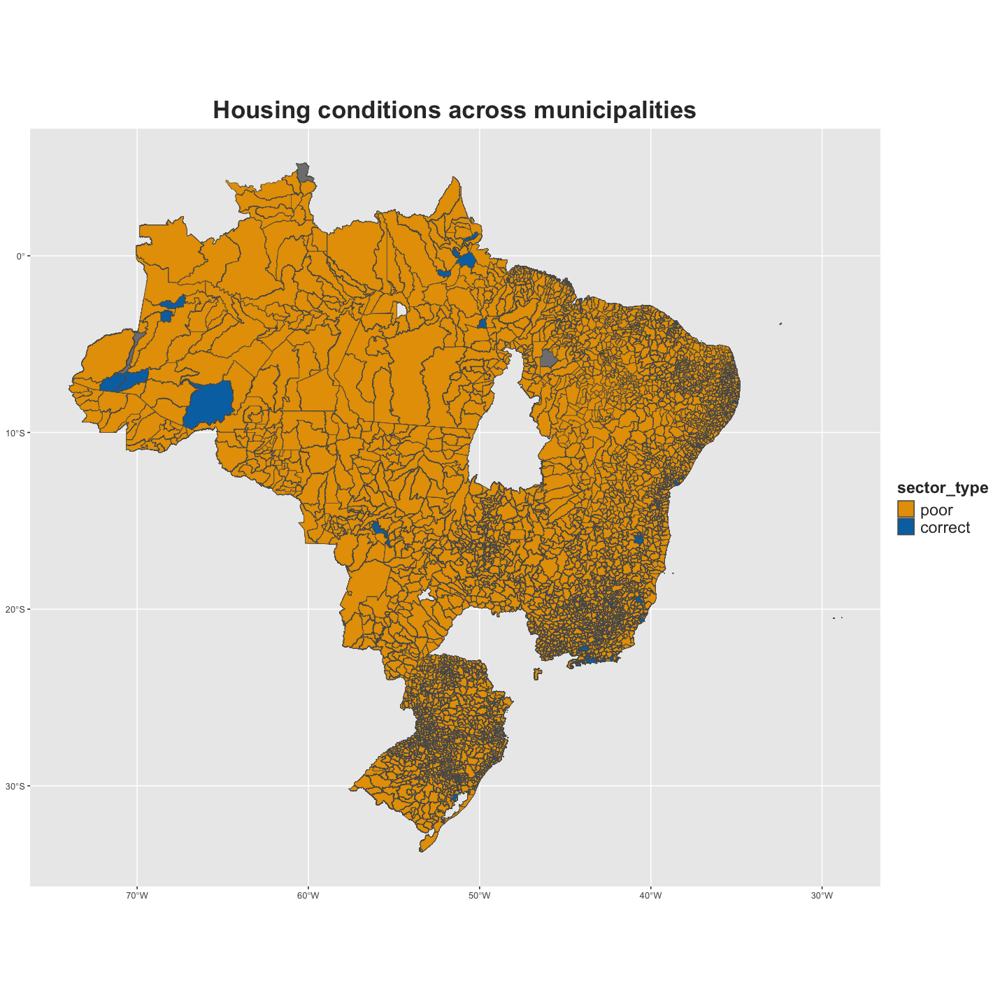
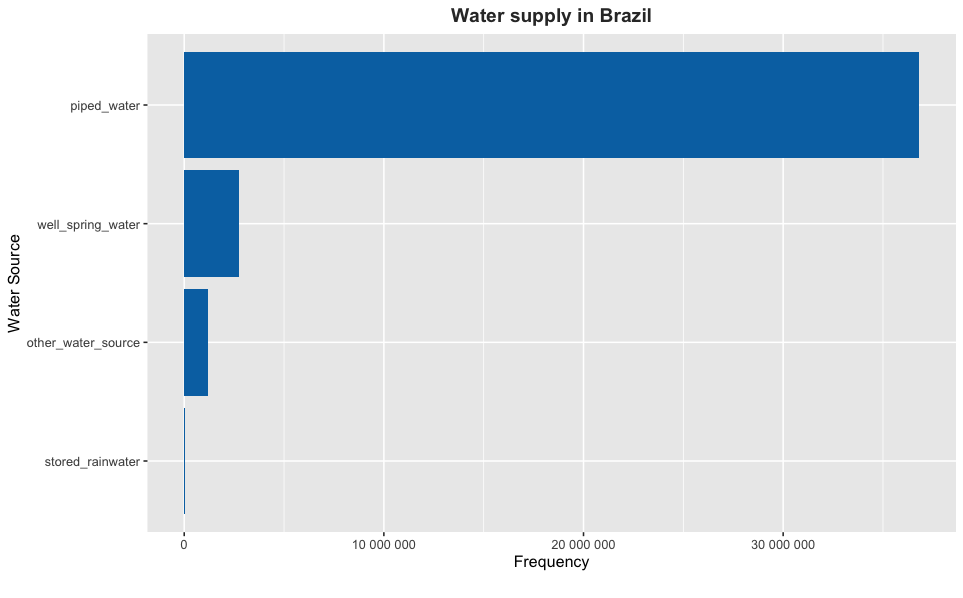

<!-- README.md is generated from README.Rmd. Please edit that file -->

# wsabrazil

<!-- badges: start -->

[](https://creativecommons.org/licenses/by/4.0/)
[](https://github.com/openwashdata/wsabrazil/actions/workflows/R-CMD-check.yaml)
<!-- badges: end -->

This package contains information related to wastewater management
practices and household infrastructure in Brazil. It includes variables
such as sector codes, metropolitan region names, municipality codes, and
names, as well as data on the location type, living conditions, average
income, and household amenities. The data provides insights into
wastewater disposal habits, water supply sources, bathroom facilities,
and sanitation infrastructure in Brazilian households, contributing to
understanding environmental sustainability and infrastructure
development efforts. “Atlas of the 2010 Demographic Census - PGI” (n.d.)
 Based on the data, it appears for example
that most of the municipalities exhibits poor housing conditions. In
this dataset, housing conditions are represented numerically, with ‘1’
indicating correct housing conditions and ‘0’ indicating poor housing
conditions. The location map displays all Brazilian municipalities from
which data has been collected.

## Installation

You can install the development version of wsabrazil from
[GitHub](https://github.com/) with:

``` r
# install.packages("devtools")
devtools::install_github("openwashdata/wsabrazil")
```

Alternatively, you can download the dataset as a CSV or XLSX file from
the table below.

| dataset   | CSV                                                                                           | XLSX                                                                                            |
|:----------|:----------------------------------------------------------------------------------------------|:------------------------------------------------------------------------------------------------|
| wsabrazil | [Download CSV](https://github.com/openwashdata/wsabrazil/raw/main/inst/extdata/wsabrazil.csv) | [Download XLSX](https://github.com/openwashdata/wsabrazil/raw/main/inst/extdata/wsabrazil.xlsx) |

## Data

The dataset includes observations of wastewater management practices and
household infrastructure (access to water and sanitation services)
across various regions in Brazil.

The package provides access to one single dataset.

``` r
library(wsabrazil)
```

The `wsabrazil` dataset has 33 variables and 192896 observations. For an
overview of the variable names, see the following table.

``` r
wsabrazil
```

<div style="border: 1px solid #ddd; padding: 0px; overflow-y: scroll; height:400px; ">

<table class="table" style="margin-left: auto; margin-right: auto;">
<thead>
<tr>
<th style="text-align:left;position: sticky; top:0; background-color: #FFFFFF;">
variable_name
</th>
<th style="text-align:left;position: sticky; top:0; background-color: #FFFFFF;">
variable_type
</th>
<th style="text-align:left;position: sticky; top:0; background-color: #FFFFFF;">
description
</th>
</tr>
</thead>
<tbody>
<tr>
<td style="text-align:left;">
sector_code
</td>
<td style="text-align:left;">
double
</td>
<td style="text-align:left;">
Sector code
</td>
</tr>
<tr>
<td style="text-align:left;">
great_region_name
</td>
<td style="text-align:left;">
character
</td>
<td style="text-align:left;">
Name of the great region
</td>
</tr>
<tr>
<td style="text-align:left;">
FU_code
</td>
<td style="text-align:left;">
integer
</td>
<td style="text-align:left;">
Federation unit code
</td>
</tr>
<tr>
<td style="text-align:left;">
FU_name
</td>
<td style="text-align:left;">
character
</td>
<td style="text-align:left;">
Federation unit name
</td>
</tr>
<tr>
<td style="text-align:left;">
meso_code
</td>
<td style="text-align:left;">
integer
</td>
<td style="text-align:left;">
Mesoregion code
</td>
</tr>
<tr>
<td style="text-align:left;">
meso_name
</td>
<td style="text-align:left;">
character
</td>
<td style="text-align:left;">
Mesoregion name
</td>
</tr>
<tr>
<td style="text-align:left;">
micro_code
</td>
<td style="text-align:left;">
integer
</td>
<td style="text-align:left;">
Microregion code
</td>
</tr>
<tr>
<td style="text-align:left;">
micro_name
</td>
<td style="text-align:left;">
character
</td>
<td style="text-align:left;">
Microregion name
</td>
</tr>
<tr>
<td style="text-align:left;">
MR_code
</td>
<td style="text-align:left;">
integer
</td>
<td style="text-align:left;">
Metropolitan region code
</td>
</tr>
<tr>
<td style="text-align:left;">
MR_name
</td>
<td style="text-align:left;">
character
</td>
<td style="text-align:left;">
Metropolitan region name
</td>
</tr>
<tr>
<td style="text-align:left;">
municipality_code
</td>
<td style="text-align:left;">
integer
</td>
<td style="text-align:left;">
Municipality code
</td>
</tr>
<tr>
<td style="text-align:left;">
municipality_name
</td>
<td style="text-align:left;">
character
</td>
<td style="text-align:left;">
Municipality name
</td>
</tr>
<tr>
<td style="text-align:left;">
district_code
</td>
<td style="text-align:left;">
integer
</td>
<td style="text-align:left;">
District code
</td>
</tr>
<tr>
<td style="text-align:left;">
district_name
</td>
<td style="text-align:left;">
character
</td>
<td style="text-align:left;">
District name
</td>
</tr>
<tr>
<td style="text-align:left;">
subdistrict_code
</td>
<td style="text-align:left;">
integer
</td>
<td style="text-align:left;">
Subdistrict code
</td>
</tr>
<tr>
<td style="text-align:left;">
subdistrict_name
</td>
<td style="text-align:left;">
character
</td>
<td style="text-align:left;">
Subdistrict name
</td>
</tr>
<tr>
<td style="text-align:left;">
neighb_code
</td>
<td style="text-align:left;">
integer
</td>
<td style="text-align:left;">
Neighborhood code
</td>
</tr>
<tr>
<td style="text-align:left;">
neighb_name
</td>
<td style="text-align:left;">
character
</td>
<td style="text-align:left;">
Neighborhood name
</td>
</tr>
<tr>
<td style="text-align:left;">
sector_situation
</td>
<td style="text-align:left;">
character
</td>
<td style="text-align:left;">
Location type: urban or rural
</td>
</tr>
<tr>
<td style="text-align:left;">
sector_type
</td>
<td style="text-align:left;">
integer
</td>
<td style="text-align:left;">
Living conditions: 1 stands for correct housing conditions, 0 stands for
poor housing conditions
</td>
</tr>
<tr>
<td style="text-align:left;">
avg_income
</td>
<td style="text-align:left;">
integer
</td>
<td style="text-align:left;">
Average nominal monthly income of permanent private households
</td>
</tr>
<tr>
<td style="text-align:left;">
total_households
</td>
<td style="text-align:left;">
integer
</td>
<td style="text-align:left;">
Number of permanent private households
</td>
</tr>
<tr>
<td style="text-align:left;">
piped_water
</td>
<td style="text-align:left;">
integer
</td>
<td style="text-align:left;">
Number of permanent private households with water supply by piped
network
</td>
</tr>
<tr>
<td style="text-align:left;">
well_spring_water
</td>
<td style="text-align:left;">
integer
</td>
<td style="text-align:left;">
Number of permanent private households with water supply by property’s
well or spring
</td>
</tr>
<tr>
<td style="text-align:left;">
stored_rainwater
</td>
<td style="text-align:left;">
integer
</td>
<td style="text-align:left;">
Number of permanent private households with water supply by stored
rainwater
</td>
</tr>
<tr>
<td style="text-align:left;">
other_water_source
</td>
<td style="text-align:left;">
integer
</td>
<td style="text-align:left;">
Number of permanent private households with water supply by other source
</td>
</tr>
<tr>
<td style="text-align:left;">
private_bathroom
</td>
<td style="text-align:left;">
integer
</td>
<td style="text-align:left;">
Number of permanent private households with private bathroom or toilet
</td>
</tr>
<tr>
<td style="text-align:left;">
bathroom_sewerage
</td>
<td style="text-align:left;">
integer
</td>
<td style="text-align:left;">
Number of permanent private households with private bathroom or toilet &
sanitation via sewerage or drainage network
</td>
</tr>
<tr>
<td style="text-align:left;">
bathroom_septic_tank
</td>
<td style="text-align:left;">
integer
</td>
<td style="text-align:left;">
Number of permanent private households with private bathroom or toilet &
sanitation via septic tank
</td>
</tr>
<tr>
<td style="text-align:left;">
bathroom_cesspit
</td>
<td style="text-align:left;">
integer
</td>
<td style="text-align:left;">
Number of permanent private households with private bathroom or toilet &
sanitation via cesspit
</td>
</tr>
<tr>
<td style="text-align:left;">
bathroom_ditch
</td>
<td style="text-align:left;">
integer
</td>
<td style="text-align:left;">
Number of permanent private households with private bathroom or toilet &
wastewater discharged into ditch
</td>
</tr>
<tr>
<td style="text-align:left;">
bathroom_waterbodies
</td>
<td style="text-align:left;">
integer
</td>
<td style="text-align:left;">
Number of permanent private households with private bathroom or toilet &
wastewater discharged into water bodies (river, lake or sea)
</td>
</tr>
<tr>
<td style="text-align:left;">
bathroom_other
</td>
<td style="text-align:left;">
integer
</td>
<td style="text-align:left;">
Number of permanent private households with private bathroom or toilet &
wastewater discharged into other outlet
</td>
</tr>
</tbody>
</table>

</div>

## Example

From the dataset, we can explore the distribution of water sources in
the whole country. We create here a horizontal bar plot to visualize the
frequency of different water sources available, utilizing variables such
as piped water or stored rainwater. We observe from the resulting plot
(see Figure below) that the majority of private households are supplied
by piped water. Interestingly, almost none of the households store
rainwater. This is possibly due to factors such as local climate
patterns and infrastructure limitations.

``` r
library(dplyr)
library(ggplot2)
library(wsabrazil)
library(tidyr)

data_long_summary <- wsabrazil |> 
  pivot_longer(cols = piped_water:other_water_source, 
                      names_to = "water_source", 
                      values_to = "frequency") |> 
  group_by(water_source) |> 
  summarise(total_frequency = sum(frequency, na.rm = TRUE)) |> 
  arrange(total_frequency)

# Create a horizontal bar plot of water source types
plot <- ggplot(data_long_summary, aes(x = total_frequency, y = reorder(water_source, total_frequency))) +
  geom_col(fill = "#0072B2") +
  labs(x = "Frequency", y = "Water Source", 
       title = "Water supply in Brazil", 
       caption = "") +
  theme(plot.title = element_text(hjust = 0.5, face = "bold", color = "#333333"))

plot + scale_x_continuous(labels = scales::number_format())
```



## License

Data are available as
[CC-BY](https://github.com/openwashdata/wsabrazil/LICENSE.md).

## Citation

To cite this package, please use:

``` r
citation("wsabrazil")
#> To cite package 'wsabrazil' in publications use:
#> 
#>   Götschmann M, Santos L (2024). "wsabrazil: Wastewater management and
#>   household infrastructure in Brazil - Demographic Census 2010."
#> 
#> A BibTeX entry for LaTeX users is
#> 
#>   @Misc{gotschmann_etall:2024,
#>     title = {wsabrazil: Wastewater management and household infrastructure in Brazil - Demographic Census 2010},
#>     author = {Margaux Götschmann and Lais Santos},
#>     year = {2024},
#>     abstract = {This dataset about wastewater management and household infrastructure from various Brazilian regions provides insights into wastewater disposal habits, water sources, bathroom facilities, and sanitation infrastructure.},
#>     version = {0.0.0.9000},
#>   }
```

## References

<div id="refs" class="references csl-bib-body hanging-indent">

<div id="ref-atlas" class="csl-entry">

“Atlas of the 2010 Demographic Census - PGI.” n.d.
https://censo2010.ibge.gov.br/apps/atlas/#/home/.

</div>

</div>
